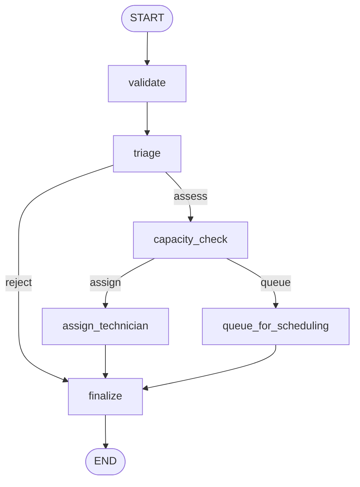

# Dispatch Triage Agent

A small agent-style service that decides what to do with an incoming field-service work
order. Built with **LangGraph** for the decision flow, **FastAPI** for HTTP, **JSON-RPC 2.0**
for the API, and **uv** for environment/dependency management.

🎬 See [`docs/dispatch-rules.html`](docs/dispatch-rules.html) for an animated walkthrough of
the dispatch rules.

---

## Overview

A site reports a broken asset. This service runs the ticket through a decision graph and
returns one of three outcomes:

| Answer | Meaning | Technician reserved? |
|---|---|---|
| 🟢 `auto_dispatch` | A technician is booked automatically | **Yes** — `technician_id` |
| 🟡 `needs_scheduling` | No room today, or too big a job; a coordinator decides | No |
| 🔴 `rejected` | Not serviceable | No |

There's no LLM involved — every branch is a plain, deterministic rule.

---

## Running it

This project is managed by **[uv](https://docs.astral.sh/uv/)**, which owns the virtual
environment, the lockfile, and the console script that starts the server — no manual venv,
no `pip install`. Sync the environment (include the `dev` extra for test tooling), then run
the console-script entry point defined in `pyproject.toml`.

Prerequisites: **Python 3.11–3.13** and `uv` (`brew install uv` on macOS).

Once running it listens on `127.0.0.1:8090` by default and exposes `GET /healthz`. The
downstream availability service is optional in the sense that the service stays up without
it — see *Availability lookups* below for how an outage is meant to be handled.

---

## Sending a request

Everything goes through a single endpoint, `POST /rpc`, using JSON-RPC 2.0.

```bash
curl -s localhost:8090/rpc -H 'content-type: application/json' -d '{
  "jsonrpc": "2.0",
  "id": "req-1",
  "method": "dispatch.triage",
  "params": {
    "ticket_id":          "TCK-1",
    "asset_id":           "AST-9001",
    "site_code":          "SFO-02",
    "issue_code":         "NO_POWER",
    "reported_hours_ago": 4,
    "estimated_minutes":  90
  }
}'
```

Example response:

```jsonc
{
  "jsonrpc": "2.0",
  "id": "req-1",
  "result": {
    "decision":      "auto_dispatch",
    "severity":      "safety",
    "serviceable":   true,
    "technician_id": "SFO-02-CERTIFIED-01",
    "sla_minutes":   60,
    "free_minutes":  480,
    "audit": ["validate", "triage", "capacity_check", "assign_technician", "finalize"]
  }
}
```

`audit` lists the graph nodes that actually ran, in order — useful for tracing what the
graph did for a given ticket. **Every run ends at `finalize`**: it is the only node that
stamps a terminal `decision`, so a run that does not reach it has not been decided.

### Methods

| `method` | What it does |
|---|---|
| `dispatch.triage` | Run a work order through the decision graph |
| `dispatch.policy` | Return the current policy thresholds |
| `agent.describe` | Capability descriptor for a parent agent |

---

## Input fields

| Field | Type | Required | Notes |
|---|---|---|---|
| `ticket_id` | string | yes | Idempotency key |
| `asset_id` | string | yes | Must be non-empty |
| `site_code` | string | yes | Must be non-empty; picks the depot |
| `issue_code` | string | yes | See below |
| `reported_hours_ago` | integer | yes | Must be ≥ 0 |
| `estimated_minutes` | integer | yes | Job duration. Must be > 0 |
| `contract_tier` | string | no | Defaults to `"standard"` |

### Issue code → severity

| `issue_code` | Severity | Technician pool | SLA | Serviceable? |
|---|---|---|---:|---|
| `NO_POWER`, `SMOKE_DETECTED` | `safety` | `certified` | 60 min | ✅ |
| `WATER_LEAK`, `OVERHEATING` | `urgent` | `certified` | 240 min | ✅ |
| `NOISE_COMPLAINT`, `COSMETIC_DAMAGE` | `routine` | `general` | 1440 min | ✅ |
| `WARRANTY_QUESTION` | `non_technical` | — | — | ❌ rejected |
| anything else | `unknown` | — | — | ❌ rejected |

A serviceable ticket reported more than `INTAKE_WINDOW_HOURS` ago is stale and is also
rejected.

---

## Decision flow



- **validate** — structural checks (asset id, site code, duration, reported hours)
- **triage** — maps `issue_code` to a severity, technician pool, and serviceability
- **capacity_check** — asks the depot for free technician minutes and applies the job-size rule
- **assign_technician** — reserves a technician and stamps the SLA
- **queue_for_scheduling** — parks the ticket for a coordinator; `technician_id` stays `""`
- **finalize** — emits the terminal `decision` and the policy `metadata`

**Short-circuit rule.** A ticket that fails `validate`, or that `triage` finds
unserviceable, goes **straight to `finalize`** and is `rejected`. It must never reach
`capacity_check` — a malformed ticket must not consume a depot lookup or hold a technician
slot. Its audit trail is exactly `["validate", "triage", "finalize"]`.

### Capacity rule

`capacity_check` auto-dispatches only when **both** hold:

- `free_minutes >= estimated_minutes + CAPACITY_BUFFER_MINUTES`
- `estimated_minutes <= MAX_AUTO_DISPATCH_MINUTES`

Otherwise the ticket is queued for scheduling.

### Availability lookups

`capacity_check` asks the downstream availability service how many technician minutes are
still free today for a **site *and* skill pool** pair.

- The lookup **fails closed**: if the depot is unreachable, times out, or answers with a
  non-2xx or unparseable body, the answer is `0` free minutes, so the ticket falls through
  to `needs_scheduling`. A broken dependency must never book a technician.
- Answers are cached to spare the depot. A cached answer is only valid for the **exact
  site + skill pair it was fetched for** — the `certified` and `general` pools at one site
  have independent capacity and must never be served each other's number.
- A cache belongs to the client instance that owns it. Two `AvailabilityClient` instances
  are independent and must not see each other's entries.

---

## JSON-RPC contract

`POST /rpc` implements JSON-RPC 2.0, including notifications and batches.

- A response envelope contains `jsonrpc: "2.0"`, echoes the request `id`, and carries
  **exactly one** of `result` or `error` — never both, never a `null` placeholder.
- A request that is not a JSON object, is missing `method`, carries a `jsonrpc` other than
  `"2.0"`, or has non-object `params` is an **Invalid Request** → `-32600`, answered with
  HTTP `200`, never a `500`.
- Unknown method → `-32601`; bad arguments to a known method → `-32602`; anything the
  handler raises → `-32000`.
- **Notifications.** A request object **without an `id` member** is a notification: the
  server does the work but sends **no response at all** — HTTP `204` with an empty body.
  Note that this is about the *absence* of the member, not about `id: null`.
- **Batches.** The body may be a JSON **array** of request objects. The server processes
  them and replies with an array of response objects — one per non-notification member, in
  request order. If every member is a notification, it replies HTTP `204` with an empty
  body. An **empty array** is an Invalid Request → a single `-32600` error object.

---

## Configuration

All optional — every setting has a working default.

| Env var | Default | Meaning |
|---|---|---|
| `HOST` / `PORT` | `127.0.0.1` / `8090` | Bind address |
| `LOG_LEVEL` | `INFO` | Python log level |
| `AVAILABILITY_SERVICE_URL` | `http://localhost:9201/availability` | Downstream depot service |
| `INTAKE_WINDOW_HOURS` | `72` | Tickets reported longer ago are stale |
| `CAPACITY_BUFFER_MINUTES` | `30` | Slack required on top of the job duration |
| `MAX_AUTO_DISPATCH_MINUTES` | `240` | Longer jobs always need scheduling |

Copy `.env.example` if you want to override anything.

---

## Project layout

```
src/dispatch_agent/
├── api.py                   FastAPI app — GET /healthz, POST /rpc
├── __main__.py              server entry point
├── config.py                env-var settings
├── rpc/                     JSON-RPC transport layer
│   ├── models.py
│   ├── dispatcher.py
│   └── methods.py
├── graph/                   the LangGraph decision flow
│   ├── state.py
│   ├── nodes.py
│   └── builder.py
└── services/                application + downstream clients
    ├── dispatch_service.py
    └── availability_client.py

tests/
├── test_graph_flow.py
├── test_availability_client.py
└── test_rpc.py
```

---

## Development

Tooling is invoked through `uv run <tool>`: `pytest` for tests, `ruff` for linting, `mypy`
for type checking.
